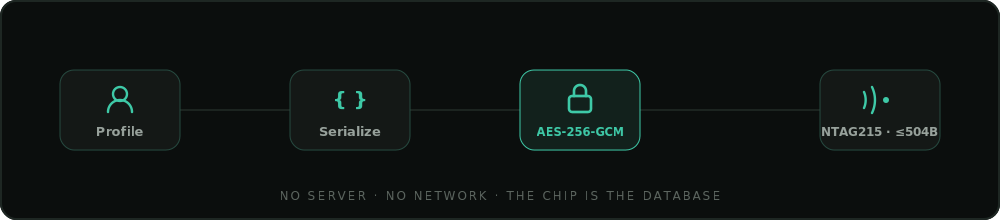

<div align="center">


<br/>

<p>
  <b>Your medical record, encrypted onto the NFC chip you wear.</b><br/>
  Readable by a first responder with <i>zero</i> internet — because in a disaster, there isn't any.
</p>

<p>
  
  
  
  
</p>

<p>
  
  
  
  
  
</p>

<sub>
  <a href="#-why">Why</a> ·
  <a href="#-what-makes-it-different">Difference</a> ·
  <a href="#-two-builds-one-brain">Builds</a> ·
  <a href="#-features">Features</a> ·
  <a href="#-architecture">Architecture</a> ·
  <a href="#-real-vs-simulated">Real vs simulated</a> ·
  <a href="#-getting-started">Getting started</a> ·
  <a href="#-prd-coverage">PRD coverage</a>
</sub>

</div>

---

## 🩸 Why

During natural disasters, mass-casualty events, or network blackouts, first responders treat patients with **zero access to prior medical history**. That causes preventable medication conflicts, allergic reactions, and duplicated treatment as a patient moves between responders, ambulances, and field hospitals.

Every competitor stores the medical data in the cloud and uses NFC as a doorbell. **Patient-Tap stores the data on the chip itself — so the doorbell still works when the house has no internet.**

<div align="center">
<table>
<tr>
<td align="center">🔌<br/><b>Offline-first</b><br/><sub>every core flow works<br/>with no network</sub></td>
<td align="center">🔐<br/><b>Encrypted on-chip</b><br/><sub>AES-256-GCM before<br/>a byte is written</sub></td>
<td align="center">🚑<br/><b>Responder write-back</b><br/><sub>log treatment in the<br/>field, onto the tag</sub></td>
<td align="center">⚠️<br/><b>Conflict checker</b><br/><sub>catches allergy &amp;<br/>overdose clashes</sub></td>
</tr>
</table>
</div>

## ⭐ What makes it different

The headline feature isn't the NFC — it's the **conflict checker**. When a responder logs a drug they're about to administer, Patient-Tap checks it against the patient's allergies, recent doses, and current medications **on-device, offline**, and blocks a dangerous administration behind an explicit override:

```text
Responder types:  "Amoxicillin"
Patient allergy:  "Penicillin"
                        ↓
🔴  Allergy conflict: Amoxicillin
    Patient is allergic to Penicillin. Amoxicillin may cross-react.
    Do not administer without override.
```

That single check is the reason a judge — or a paramedic — remembers this project.

## 📱 Two builds, one brain

This folder ships **two independent [Next.js](https://nextjs.org) apps** that share one logic core. Point your phone at either.

| |  `android/` |  `iOS/` |
|---|---|---|
| **Design language** | Redesigned **"field-equipment"** theme — surgical-teal accent, warm-charcoal surfaces, mono machine-labels, grain | Original dark **fintech** theme — violet accent, iOS chrome |
| **Chrome** | Material 3 — bottom nav w/ labels, Material switches, punch-hole | Notch, floating-pill tab bar, iOS toggles, large titles |
| **Type** | Manrope + Space Grotesk | SF system stack |
| **Tag access** | 🟢 **Read + write** (NTAG215) | 🔵 **Read-only** (NDEF fallback — per spec) |
| **Dev port** | `3020` | `3010` |

> The two apps are identical except **`lib/platform.ts`** (one constant, `PLATFORM`) and the CSS/chrome skin. `CAN_WRITE_TAG` is derived from it, so iOS enforces read-only automatically.

## ✨ Features

<table>
<tr>
<td width="50%" valign="top">

#### 🔓 Lock, not login
A local **4–6 digit PIN** (salted SHA-256, never stored in plaintext) gates *editing your own profile*. Optional biometric. Responder mode needs **no login at all** — frictionless in an emergency.

#### 📝 Profile + document auto-fill
Manual entry, or **scan a prescription / discharge summary**. On-device OCR extracts labelled fields (`Blood Group:`, `Allergic to:`, drug names) and pre-fills the form — **you review every field before it saves.**

#### ⏰ Medication reminders
Per-medication schedule → **offline local notifications** at dose time. No server, no push service.

</td>
<td width="50%" valign="top">

#### 💾 Selective write to tag
Choose exactly which categories go on the wristband. A **live 504-byte budget meter** updates as you toggle, and warns before you overflow the tag.

#### 🚑 Responder mode
Tap → decrypt → the profile appears in **under a second**, allergies and DNR shown first. Log a treatment (conflict-checked), and it's **written back to the tag** so it travels with the patient.

#### 📟 Emergency alert
On scan, the primary emergency contact is alerted with an **SMS body + live GPS location**.

</td>
</tr>
</table>

**Color carries meaning, never decoration** — 🔴 danger (allergy · DNR · conflict) · 🟡 caution (reminders · unconfirmed OCR) · 🟢 teal (brand · success · verified).

## 🏗 Architecture

**No server. No network. The chip is the database.** Everything runs on-device.

<div align="center">

</div>

```text
                          ┌───────────────── PATIENT ──────────────────┐
   document photo ─▶ on-device OCR ─▶ field parser ─▶ review ─▶ profile
                                                                  │
                              select categories ─▶ serialize ─▶ AES-256-GCM ─▶ 🏷 NTAG215 (≤504 B)

                          ┌──────────────── RESPONDER ─────────────────┐
   tap 🏷 ─▶ read ─▶ decrypt ─▶ prioritized display
                        └─▶ log entry ─▶ conflict check ─▶ re-encrypt ─▶ re-write to 🏷
                        └─▶ SMS + GPS alert to emergency contact
```

## 🔬 Real vs simulated

A browser can't touch native hardware, so those parts are simulated — but **everything that can be real, is.**

<table>
<tr>
<th>✅ Genuinely real</th>
<th>🟡 Simulated (native-only in production)</th>
</tr>
<tr>
<td valign="top">

- **AES-256-GCM** encrypt/decrypt — Web Crypto
- **Tamper detection** via the GCM auth tag
- **PIN hashing** — salted SHA-256, never plaintext
- **Conflict checker** — allergy / dose / interaction
- **Live 504-byte budget** as categories toggle
- **Local-notification reminders** — Notification API
- **GPS** — Geolocation API (real fix when permitted)

</td>
<td valign="top">

- **NFC tag** → `localStorage`; real **Web NFC** (`NDEFReader`) is attempted first on Chrome-Android
- **SMS** → composed body + `sms:` deep link, not `SmsManager`
- **OCR** → the ML Kit pass is stubbed; **the field parser is real** and runs on the extracted text
- **Android Keystore** → a fixed derived key stands in for hardware key sealing

</td>
</tr>
</table>

> This mirrors the PRD's own guidance to be upfront that OCR is a beta-quality feature and that a live NFC demo needs a backup path.

## 🚀 Getting started

```bash
# Android build (the redesigned one) → http://localhost:3020
cd "android"
npm install
npm run dev

# iOS build → http://localhost:3010
cd "iOS"
npm install
npm run dev
```

<sub>Open in a mobile viewport (~<code>440×940</code>) for the device framing. <code>npm run build</code> type-checks and produces a production bundle.</sub>

<details>
<summary><b>▶ Demo it in 60 seconds</b></summary>

<br/>

1. **Create a PIN** (e.g. `1234`, then confirm) — a lock screen, not an account.
2. **Settings → Load demo profile** — populates Aarav Mehta (O+, Penicillin/Sulfa allergies, 2 meds, 2 contacts).
3. **Tag** tab → review the live byte budget → **Write to tag**.
4. **Responder** tab → *Tap to scan* → profile decrypts in <1 s, allergies/DNR first, contact alerted.
5. Tap **Log treatment**, choose **Amoxicillin** → the conflict checker flags the Penicillin cross-reaction and demands an override.
6. Re-scan the tag → your logged entry is still there. It persisted **on the chip.**

</details>

## 🧠 Tech stack

<p>
  
  
  
  
  
  
</p>

No UI framework, no CSS library — a hand-built design system in plain CSS variables (which also sidesteps a Tailwind config gotcha in this repo's path). Minimal dependencies: `next`, `react`, `react-dom`.

<details>
<summary><b>📁 Project structure</b> (identical in both folders)</summary>

```text
app/
  layout.tsx          root layout + fonts (Android) / metadata
  page.tsx            client-mount guard (avoids SSR/localStorage mismatch)
  globals.css         the entire design system
components/
  App.tsx             device shell · lock gate · tab + sub-route navigation
  AppContext.tsx      global state (profile, unlock, toast, routing) + persistence
  ui/
    Icons.tsx         monoline SVG icon set
    Widgets.tsx       StatusBar · Switch · Sheet · Ring · BudgetMeter · Banner · Toast
  screens/
    Lock · Home · ProfileEdit · ScanDoc · Reminders · WriteTag · Responder · Settings
lib/
  types.ts            data schema (mirrors the PRD protobuf draft)
  crypto.ts           AES-256-GCM + PIN hashing (Web Crypto)
  store.ts            localStorage persistence · compact serialization · byte estimation
  tag.ts              NFC read/write — Web NFC + simulated NTAG215, retry + error codes
  conflict.ts         ⭐ the differentiator — allergy / dose / interaction checks
  ocr.ts              field parser + sample documents
  reminders.ts        offline notification scheduling
  alert.ts            SMS body + GPS capture
  platform.ts         the ONE file that differs between iOS and Android
```

</details>

<details>
<summary><b>✅ PRD coverage</b></summary>

<br/>

| ID | Requirement | Where |
|---|---|---|
| F0.1–F0.4 | Local PIN lock + biometric; responder needs no login | `screens/Lock.tsx`, `App.tsx` |
| F1 | Manual profile (name, blood type, allergies, meds, DNR, ≤3 contacts) | `screens/ProfileEdit.tsx` |
| F2.1–F2.5 | Document scan → on-device OCR → parse → **review before save** | `screens/ScanDoc.tsx`, `lib/ocr.ts` |
| F3.1–F3.4 | Medication reminders, offline local notifications | `screens/Reminders.tsx`, `lib/reminders.ts` |
| F4.1–F4.6 | Selective write with live byte budget + 504-byte warning | `screens/WriteTag.tsx`, `lib/store.ts` |
| F7–F12 | Responder scan, prioritized display, conflict-checked logging, write-back, SMS+GPS | `screens/Responder.tsx`, `lib/conflict.ts`, `lib/alert.ts` |
| F13–F16 | AES-256-GCM, tamper detection, retry (3×), clear error states | `lib/crypto.ts`, `lib/tag.ts` |

</details>

<details>
<summary><b>🔐 Security notes</b></summary>

<br/>

- Profile bytes are **AES-256-GCM** encrypted before touching the tag; a corrupted or tampered tag fails the GCM auth-tag check and surfaces as an error (F13/F14).
- The PIN is a **salted SHA-256 hash** in `localStorage` — never stored in plaintext.
- **Demo simplification:** a production system would seal the key in the Android Keystore and solve responder-side key distribution properly. For a single-app demo where one app plays both patient and responder, a fixed derived key lets any scan decrypt any tag written here.

</details>

## ⚖️ Honest scoping

This is a faithful **web** realization of the Patient-Tap PRD, built with Next.js. The PRD's technical section specifies a **native Kotlin** Android app with real NTAG215 hardware and Google ML Kit. This build is ideal for demonstrating the UX and the full end-to-end flow, but the hardware-bound pieces (real NFC writes, SMS, on-device ML Kit OCR) are simulated as noted above — it is **not** the on-device native app the architecture section describes.

<div align="center">
<br/>
<sub>Built to the Patient-Tap PRD v2.0 · <code>Edge-Medical Sovereignty System</code></sub>
<br/>
<sub>🏷 <b>The medical record lives on the chip — not the cloud.</b></sub>
<br/><br/>
</div>
